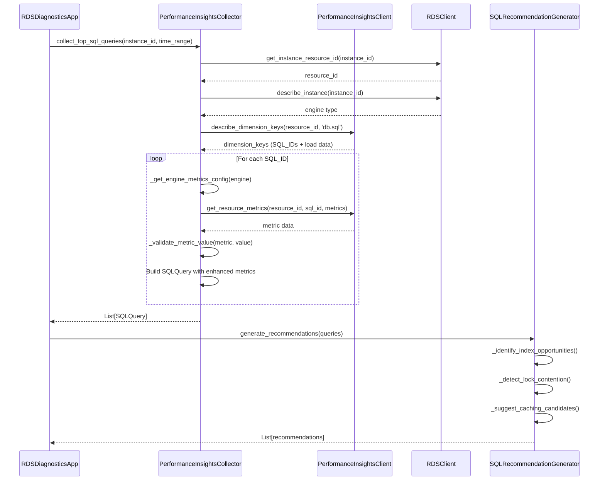

# Design Document: Enhanced SQL Metadata Collection

## Overview

This design enhances the RDS Diagnostics Tool's Performance Insights integration to collect comprehensive SQL query metadata beyond the current basic load metrics. The enhancement addresses three key limitations:

1. **Incomplete SQL Text**: Current implementation truncates queries at 200 characters, making complex query analysis difficult
2. **Limited Metrics**: Only collects database load (AAS) without execution-specific metrics like CPU time, lock time, or I/O statistics
3. **Engine Agnostic**: Doesn't leverage engine-specific metrics available in different RDS engines (MySQL, PostgreSQL, Oracle, Aurora variants)

The design introduces a two-phase collection approach: first using `describe_dimension_keys` to identify top SQL queries, then using `get_resource_metrics` to retrieve detailed metrics for each query. This provides rich diagnostic data while maintaining backward compatibility and handling engine-specific metric availability gracefully.

### Key Design Decisions

**Use get_resource_metrics for detailed metrics**: The current implementation only uses `describe_dimension_keys`, which provides aggregated load data. The `get_resource_metrics` API provides access to detailed per-query metrics including execution counts, CPU time, lock time, and I/O statistics.

**Engine-specific metric mapping**: Different RDS engines expose different metrics through Performance Insights. We'll maintain a mapping structure that defines available metrics per engine type, allowing graceful degradation when metrics aren't available.

**No calculations in data collection**: Store metrics exactly as returned by AWS API. All calculations (efficiency ratios, percentages) happen only in the recommendation generator, keeping raw data pure and verifiable.

**Backward compatibility through optional fields**: All new SQLQuery fields are Optional, allowing existing code to continue working while new code can leverage enhanced data when available.

## Architecture

### Component Overview

```
┌─────────────────────────────────────────────────────────────────┐
│                    RDSDiagnosticsApp                             │
│                     (Orchestrator)                               │
└────────────────────────────┬────────────────────────────────────┘
                             │
                             ▼
┌─────────────────────────────────────────────────────────────────┐
│            PerformanceInsightsCollector                          │
│  ┌──────────────────────────────────────────────────────────┐  │
│  │  collect_top_sql_queries()                                │  │
│  │    1. Check PI enabled                                    │  │
│  │    2. Get resource_id                                     │  │
│  │    3. Call describe_dimension_keys (identify queries)     │  │
│  │    4. For each SQL_ID:                                    │  │
│  │       - Get engine-specific metrics via                   │  │
│  │         get_resource_metrics                              │  │
│  │       - Parse and validate metrics                        │  │
│  │    5. Build SQLQuery objects with enhanced data           │  │
│  └──────────────────────────────────────────────────────────┘  │
│                                                                  │
│  ┌──────────────────────────────────────────────────────────┐  │
│  │  _get_engine_metrics_config()                             │  │
│  │    - Returns metric names for specific engine type        │  │
│  │    - Handles MySQL, PostgreSQL, Oracle, Aurora variants   │  │
│  └──────────────────────────────────────────────────────────┘  │
│                                                                  │
│  ┌──────────────────────────────────────────────────────────┐  │
│  │  _collect_query_metrics()                                 │  │
│  │    - Calls get_resource_metrics with engine-specific      │  │
│  │      metric list                                          │  │
│  │    - Handles pagination                                   │  │
│  │    - Validates metric values                              │  │
│  └──────────────────────────────────────────────────────────┘  │
└────────────────────────────┬─────────────────────────────────────┘
                             │
                             ▼
┌─────────────────────────────────────────────────────────────────┐
│                      SQLQuery Model                              │
│  (Extended with optional fields)                                 │
│                                                                  │
│  Existing:                    New Optional Fields:               │
│  - query_id                   - engine_type                      │
│  - query_text                 - executions_per_second            │
│  - total_execution_time       - cpu_time                         │
│  - average_execution_time     - lock_time                        │
│  - execution_count            - rows_examined                    │
│  - rows_affected              - rows_returned                    │
│  - wait_events                - read_io_bytes                    │
│                               - write_io_bytes                   │
└────────────────────────────┬─────────────────────────────────────┘
                             │
                             ▼
┌─────────────────────────────────────────────────────────────────┐
│                  SQLRecommendationGenerator                      │
│  (New component in analysis/)                                    │
│                                                                  │
│  - analyze_query_efficiency()                                    │
│  - identify_index_opportunities()                                │
│  - detect_lock_contention()                                      │
│  - suggest_caching_candidates()                                  │
│  - calculate_efficiency_ratios() [ONLY HERE]                     │
└────────────────────────────┬─────────────────────────────────────┘
                             │
                             ▼
┌─────────────────────────────────────────────────────────────────┐
│                    Report Formatters                             │
│  (Enhanced to display new metrics)                               │
│                                                                  │
│  - TechnicalReportFormatter: Full SQL text + metrics table       │
│  - ManagementReportFormatter: SQL summary with top issues        │
│  - JSON formatter: All fields with null for unavailable          │
└─────────────────────────────────────────────────────────────────┘
```

### Data Flow

1. **Query Identification Phase**
   - Call `describe_dimension_keys` with `group_by='db.sql'` to get top SQL queries by load
   - Extract SQL_ID and SQL text from dimension keys
   - Deduplicate by SQL_ID

2. **Metric Collection Phase**
   - For each SQL_ID, determine engine-specific available metrics
   - Call `get_resource_metrics` with metric list and SQL_ID filter
   - Parse response and extract metric values
   - Validate metrics (non-negative, within expected ranges)
   - Store exactly as returned (no calculations)

3. **Analysis Phase**
   - Pass SQLQuery objects to SQLRecommendationGenerator
   - Calculate efficiency ratios and identify patterns
   - Generate prioritized recommendations

4. **Reporting Phase**
   - Format SQL text with proper line breaks
   - Display metrics in structured tables with units
   - Show "N/A" for unavailable metrics
   - Include recommendations section with calculated insights

## Components and Interfaces

### Enhanced PerformanceInsightsCollector

**Location**: `collectors/performance_insights.py`

**New Methods**:

```python
def _get_engine_metrics_config(self, engine: str) -> Dict[str, List[str]]:
    """
    Get available Performance Insights metrics for a specific engine.
    
    Args:
        engine: RDS engine type (e.g., 'mysql', 'postgres', 'aurora-mysql')
        
    Returns:
        Dictionary mapping metric categories to metric names
        
    Example return:
        {
            'execution': ['db.sql.stats.executions_per_sec', 'db.sql.stats.total_time'],
            'resource': ['db.sql.stats.cpu_time', 'db.sql.stats.lock_time'],
            'rows': ['db.sql.stats.rows_examined', 'db.sql.stats.rows_sent'],
            'io': ['db.sql.stats.read_io_bytes', 'db.sql.stats.write_io_bytes']
        }
    """
    pass

def _collect_query_metrics(
    self,
    resource_id: str,
    sql_id: str,
    engine: str,
    time_range: TimeRange
) -> Dict[str, Optional[float]]:
    """
    Collect detailed metrics for a specific SQL query.
    
    Args:
        resource_id: Performance Insights resource identifier
        sql_id: SQL query identifier
        engine: RDS engine type
        time_range: Time range for metric collection
        
    Returns:
        Dictionary of metric names to values (None if unavailable)
        
    Note:
        - Uses get_resource_metrics API
        - Handles pagination automatically
        - Returns values exactly as provided by API
        - No aggregation or calculation performed
    """
    pass

def _validate_metric_value(
    self,
    metric_name: str,
    value: Any
) -> Optional[float]:
    """
    Validate a metric value for basic sanity checks.
    
    Args:
        metric_name: Name of the metric
        value: Raw value from API
        
    Returns:
        Validated float value or None if invalid
        
    Validation rules:
        - Must be numeric
        - Must be non-negative for time/count metrics
        - Must not be infinity or NaN
        - Logs warning for invalid values
    """
    pass
```

**Modified Methods**:

```python
def collect_top_sql_queries(
    self,
    instance_id: str,
    time_range: TimeRange,
    limit: int = 10
) -> List[SQLQuery]:
    """
    Collect top SQL queries with enhanced metrics.
    
    Enhanced behavior:
        1. Use describe_dimension_keys to identify top queries
        2. For each query, call _collect_query_metrics
        3. Build SQLQuery with all available metrics
        4. Handle missing metrics gracefully (set to None)
        5. Fall back to basic collection if enhanced fails
    
    Backward compatibility:
        - Maintains existing signature
        - Returns same SQLQuery type (with optional new fields)
        - Gracefully degrades if get_resource_metrics unavailable
    """
    pass
```

### Engine Metrics Mapping

**Metric Availability by Engine**:

| Metric | MySQL/MariaDB | PostgreSQL | Oracle | Aurora MySQL | Aurora PostgreSQL |
|--------|---------------|------------|--------|--------------|-------------------|
| executions_per_sec | ✓ | ✓ | ✓ | ✓ | ✓ |
| total_time | ✓ | ✓ | ✓ | ✓ | ✓ |
| cpu_time | ✓ | ✓ | ✓ | ✓ | ✓ |
| lock_time | ✓ | ✗ | ✓ | ✓ | ✗ |
| rows_examined | ✓ | ✗ | ✗ | ✓ | ✗ |
| rows_sent | ✓ | ✓ | ✓ | ✓ | ✓ |
| read_io_bytes | ✓ | ✓ | ✓ | ✓ | ✓ |
| write_io_bytes | ✓ | ✓ | ✓ | ✓ | ✓ |

**Performance Insights Metric Names**:

```python
ENGINE_METRICS = {
    'mysql': {
        'execution': [
            'db.sql.stats.executions_per_sec',
            'db.sql.stats.total_time_ms'
        ],
        'resource': [
            'db.sql.stats.cpu_time_ms',
            'db.sql.stats.lock_time_ms'
        ],
        'rows': [
            'db.sql.stats.rows_examined',
            'db.sql.stats.rows_sent'
        ],
        'io': [
            'db.sql.stats.innodb_io_r_bytes',
            'db.sql.stats.innodb_io_w_bytes'
        ]
    },
    'postgres': {
        'execution': [
            'db.sql.stats.calls_per_sec',
            'db.sql.stats.total_time_ms'
        ],
        'resource': [
            'db.sql.stats.cpu_time_ms'
        ],
        'rows': [
            'db.sql.stats.rows'
        ],
        'io': [
            'db.sql.stats.shared_blks_read',
            'db.sql.stats.shared_blks_written'
        ]
    },
    # Similar mappings for oracle, aurora-mysql, aurora-postgresql
}
```

### Extended SQLQuery Model

**Location**: `core/models.py`

```python
@dataclass
class SQLQuery:
    """Information about a SQL query from Performance Insights."""
    # Existing fields (maintained for backward compatibility)
    query_id: str
    query_text: str
    total_execution_time: float
    average_execution_time: float
    execution_count: int
    rows_affected: Optional[int] = None
    wait_events: List[str] = field(default_factory=list)
    
    # New optional fields for enhanced metrics
    engine_type: Optional[str] = None
    executions_per_second: Optional[float] = None
    cpu_time: Optional[float] = None  # milliseconds
    lock_time: Optional[float] = None  # milliseconds
    rows_examined: Optional[int] = None
    rows_returned: Optional[int] = None
    read_io_bytes: Optional[int] = None
    write_io_bytes: Optional[int] = None
```

### SQLRecommendationGenerator

**Location**: `analysis/sql_analyzer.py` (new file)

```python
class SQLRecommendationGenerator:
    """Generates recommendations based on SQL query metrics."""
    
    def generate_recommendations(
        self,
        queries: List[SQLQuery]
    ) -> List[str]:
        """
        Generate prioritized recommendations for SQL queries.
        
        Args:
            queries: List of SQL queries with metrics
            
        Returns:
            List of recommendation strings, prioritized by impact
        """
        pass
    
    def _calculate_efficiency_ratio(
        self,
        query: SQLQuery
    ) -> Optional[float]:
        """
        Calculate efficiency ratio (rows_returned / rows_examined).
        
        Returns:
            Ratio between 0 and 1, or None if metrics unavailable
            
        Note: This is the ONLY place where calculations happen.
              Raw data remains unmodified.
        """
        pass
    
    def _identify_index_opportunities(
        self,
        queries: List[SQLQuery]
    ) -> List[str]:
        """
        Identify queries that may benefit from indexing.
        
        Criteria:
            - rows_examined >> rows_returned (ratio < 0.1)
            - High total_execution_time
            - High execution_count
        """
        pass
    
    def _detect_lock_contention(
        self,
        queries: List[SQLQuery]
    ) -> List[str]:
        """
        Identify queries with significant lock contention.
        
        Criteria:
            - lock_time > 30% of total_execution_time
            - High execution_count
        """
        pass
    
    def _suggest_caching_candidates(
        self,
        queries: List[SQLQuery]
    ) -> List[str]:
        """
        Identify queries that may benefit from caching.
        
        Criteria:
            - High execution_count
            - Low average_execution_time
            - Consistent results (heuristic based on query pattern)
        """
        pass
```

### Enhanced Report Formatters

**Location**: `reporting/formatters.py`

**Changes to TechnicalReportFormatter**:

```python
def _format_sql_query_section(
    self,
    queries: List[SQLQuery]
) -> List[str]:
    """
    Format SQL queries with enhanced metrics.
    
    Output format:
        1. Query ID: sql-abc123
           Engine: mysql
           Total Execution Time: 1234.56 ms
           Average Execution Time: 12.34 ms
           Execution Count: 100
           Executions/sec: 0.5 calls/sec
           CPU Time: 890.12 ms (72.1% of total)
           Lock Time: 45.67 ms (3.7% of total)
           Rows Examined: 10000
           Rows Returned: 100
           Efficiency Ratio: 1.0% (potential index opportunity)
           Read I/O: 2.5 MB
           Write I/O: 0.1 MB
           
           SQL Text:
           SELECT u.id, u.name, o.order_date
           FROM users u
           JOIN orders o ON u.id = o.user_id
           WHERE o.status = 'pending'
           ORDER BY o.order_date DESC
           LIMIT 100
    
    Handles:
        - Long SQL text (>100 lines): show first 50 lines + "... (truncated)"
        - Missing metrics: display "N/A"
        - Units for all metrics
        - Calculated percentages only in display (not in model)
    """
    pass
```

## Data Models

### SQLQuery Extended Model

```python
@dataclass
class SQLQuery:
    """
    Complete SQL query information from Performance Insights.
    
    Fields are divided into three categories:
    1. Core fields (always present)
    2. Basic metrics (usually present)
    3. Enhanced metrics (engine-dependent, optional)
    """
    
    # Core identification
    query_id: str  # SQL_ID from Performance Insights
    query_text: str  # Full SQL text (up to 10,000 chars)
    engine_type: Optional[str] = None  # e.g., 'mysql', 'postgres', 'aurora-mysql'
    
    # Basic execution metrics
    total_execution_time: float  # Total time in milliseconds
    average_execution_time: float  # Average time per execution in milliseconds
    execution_count: int  # Number of executions in time range
    executions_per_second: Optional[float] = None  # Calls per second
    
    # Resource consumption metrics (engine-dependent)
    cpu_time: Optional[float] = None  # CPU time in milliseconds
    lock_time: Optional[float] = None  # Lock wait time in milliseconds
    
    # Row processing metrics (engine-dependent)
    rows_examined: Optional[int] = None  # Rows scanned
    rows_returned: Optional[int] = None  # Rows returned to client
    rows_affected: Optional[int] = None  # Rows modified (INSERT/UPDATE/DELETE)
    
    # I/O metrics (engine-dependent)
    read_io_bytes: Optional[int] = None  # Bytes read from storage
    write_io_bytes: Optional[int] = None  # Bytes written to storage
    
    # Wait event information
    wait_events: List[str] = field(default_factory=list)
```

### Configuration Extension

**Location**: `core/config.py`

```python
@dataclass
class PerformanceInsightsConfig:
    """Configuration for Performance Insights collection."""
    
    enabled: bool = True
    max_queries: int = 25  # Maximum number of queries to collect
    collect_enhanced_metrics: bool = True  # Enable enhanced metric collection
    fallback_on_error: bool = True  # Fall back to basic collection if enhanced fails
    
    # Metric collection preferences
    collect_cpu_metrics: bool = True
    collect_lock_metrics: bool = True
    collect_io_metrics: bool = True
    collect_row_metrics: bool = True
```


## Correctness Properties

*A property is a characteristic or behavior that should hold true across all valid executions of a system—essentially, a formal statement about what the system should do. Properties serve as the bridge between human-readable specifications and machine-verifiable correctness guarantees.*

### Property Reflection

After analyzing all acceptance criteria, I identified several areas of redundancy:

**Redundancy Group 1: Metric Request Verification (2.1-2.5)**
- Requirements 2.1-2.5 all test that specific metrics are included in API requests
- These can be combined into a single property: "For any metric collection request, all configured metrics for the engine type are included"
- This eliminates 5 separate properties into 1 comprehensive property

**Redundancy Group 2: Engine-Specific Metric Requests (3.1-3.5)**
- Requirements 3.1-3.5 all test conditional metric requests based on engine support
- These are subsumed by the property from Group 1 when combined with engine mapping
- Eliminates 5 redundant properties

**Redundancy Group 3: Null Storage for Missing Metrics (2.7, 4.3)**
- Requirements 2.7 and 4.3 both test that missing metrics are stored as null
- These are identical and can be combined into one property
- Eliminates 1 redundant property

**Redundancy Group 4: No Modification of API Data (5.3, 10.5)**
- Requirements 5.3 and 10.5 both test that API data is stored without modification
- These are identical and can be combined into one property
- Eliminates 1 redundant property

**Redundancy Group 5: Metric Validation (10.1-10.3)**
- Requirements 10.1-10.3 all test non-negative validation for different metric types
- These can be combined into one property: "For any metric value, validation ensures non-negative values for time/count/rate metrics"
- Eliminates 3 separate properties into 1

**Redundancy Group 6: Report Metric Display (6.5, 6.6)**
- Requirements 6.5 and 6.6 both test metric display formatting
- These can be combined into one property about consistent metric formatting
- Eliminates 1 redundant property

After reflection, we reduce from 78 potential properties to approximately 35 unique, non-redundant properties.

### Property 1: SQL Text Round-Trip Preservation

*For any* SQL query text of any length up to 10,000 characters, storing the text in a SQLQuery object and then retrieving it SHALL produce the exact original text without modification.

**Validates: Requirements 1.1, 1.5**

### Property 2: Engine-Specific Metric Collection

*For any* RDS engine type and metric collection request, the collector SHALL request only the metrics that are supported by that specific engine type according to the engine metrics mapping.

**Validates: Requirements 3.1, 3.2, 3.3, 3.4, 3.5, 4.1**

### Property 3: Null Storage for Unavailable Metrics

*For any* metric that is not provided by the Performance Insights API response, the SQLQuery model SHALL store null for that field without performing any calculation or substitution.

**Validates: Requirements 2.7, 4.3**

### Property 4: API Data Preservation

*For any* metric value returned by the Performance Insights API, the stored value in the SQLQuery model SHALL be exactly equal to the API-provided value without any aggregation, calculation, or modification.

**Validates: Requirements 5.3, 10.5**

### Property 5: SQL_ID Extraction from Dimension Keys

*For any* valid Performance Insights dimension key response, the collector SHALL successfully extract the SQL_ID from the dimension key structure.

**Validates: Requirements 5.1**

### Property 6: Metric Parsing Completeness

*For any* Performance Insights metric data response containing requested metrics, the collector SHALL parse and store all metrics present in the response.

**Validates: Requirements 5.2**

### Property 7: Metric Value Validation

*For any* metric value (time, count, or rate), the validation function SHALL verify that the value is non-negative, not infinity, and not NaN, returning null for invalid values.

**Validates: Requirements 5.5, 10.1, 10.2, 10.3**

### Property 8: Report SQL Text Display

*For any* SQLQuery object, the technical report formatter SHALL include the complete SQL query text in the formatted output.

**Validates: Requirements 6.1**

### Property 9: Report Metric Table Structure

*For any* SQLQuery object with metrics, the technical report formatter SHALL display all collected metrics in a structured format with consistent field labels.

**Validates: Requirements 6.2**

### Property 10: Report Query Sorting

*For any* list of SQL queries, the report formatter SHALL sort them by total_execution_time in descending order (highest first).

**Validates: Requirements 6.4**

### Property 11: Report Missing Metric Display

*For any* SQLQuery metric field that is null, the report formatter SHALL display "N/A" in the output instead of null, empty string, or other placeholder.

**Validates: Requirements 6.5**

### Property 12: Report Metric Units

*For any* metric displayed in a report, the formatter SHALL include the appropriate unit (e.g., "ms", "calls/sec", "bytes") alongside the value.

**Validates: Requirements 6.6**

### Property 13: JSON Field Completeness

*For any* SQLQuery object, the JSON formatter SHALL include all enhanced metadata fields in the JSON output, using null for unavailable metrics.

**Validates: Requirements 11.1, 11.3**

### Property 14: JSON Field Naming Convention

*For any* field in the JSON output, the field name SHALL follow snake_case naming convention.

**Validates: Requirements 11.2**

### Property 15: JSON Validity

*For any* generated JSON report, the output SHALL be valid JSON that can be successfully parsed by a standard JSON parser.

**Validates: Requirements 11.4**

### Property 16: JSON Round-Trip Preservation

*For any* JSON report, parsing the JSON string and then serializing it back to JSON SHALL produce equivalent data structures.

**Validates: Requirements 11.5**

### Property 17: Configuration-Driven Metric Collection

*For any* metric collection configuration specifying a subset of metrics, the collector SHALL request only the metrics specified in the configuration.

**Validates: Requirements 12.1**

### Property 18: Efficiency Metric Calculation

*For any* SQL query with both total_execution_time and execution_count available, the recommendation generator SHALL calculate efficiency metrics (e.g., average time per execution).

**Validates: Requirements 13.1**

### Property 19: High Execution Time Detection

*For any* SQL query with high total_execution_time and low execution_count, the recommendation generator SHALL flag it as a candidate for optimization.

**Validates: Requirements 13.2**

### Property 20: High Frequency Query Detection

*For any* SQL query with high execution_count and low average_execution_time, the recommendation generator SHALL flag it as a candidate for caching.

**Validates: Requirements 13.3**

### Property 21: Index Opportunity Detection

*For any* SQL query where rows_examined is significantly higher than rows_returned (ratio < 0.1), the recommendation generator SHALL suggest index optimization.

**Validates: Requirements 13.4**

### Property 22: Lock Contention Detection

*For any* SQL query where lock_time exceeds 30% of total_execution_time, the recommendation generator SHALL suggest reviewing transaction isolation levels.

**Validates: Requirements 13.5**

### Property 23: CPU-Intensive Query Detection

*For any* SQL query where cpu_time is disproportionately high relative to total_execution_time, the recommendation generator SHALL suggest query optimization or hardware scaling.

**Validates: Requirements 13.6**

### Property 24: Calculation Isolation

*For any* SQLQuery data model instance, the model SHALL NOT contain any calculated fields (ratios, percentages, derived metrics), with all calculations performed only in the recommendation generator.

**Validates: Requirements 13.7**

### Property 25: Recommendation Prioritization

*For any* list of recommendations generated from SQL queries, the recommendations SHALL be ordered by potential impact, with queries having the highest total_execution_time prioritized first.

**Validates: Requirements 13.8**

### Property 26: Graceful Error Continuation

*For any* RDS instance where Performance Insights is not enabled or returns an error, the collector SHALL handle the error gracefully without raising exceptions that halt processing of other instances.

**Validates: Requirements 4.2, 8.4**

## Error Handling

### API Error Handling Strategy

**Rate Limiting**:
- Implement exponential backoff with jitter for rate limit errors
- Retry up to 3 times with delays: 1s, 2s, 4s
- Log each retry attempt at INFO level
- After 3 failures, log ERROR and continue with next instance

**Authentication Errors**:
- Catch `ClientError` with error code `AccessDeniedException`
- Provide clear error message: "Performance Insights access denied. Verify IAM permissions include 'pi:DescribeDimensionKeys' and 'pi:GetResourceMetrics'"
- Do not retry (authentication won't change mid-execution)
- Continue with next instance

**Service Unavailable**:
- Catch `ClientError` with error code `ServiceUnavailable`
- Log WARNING with instance ID
- Do not retry (service issues are transient and outside our control)
- Continue with next instance

**Invalid Parameters**:
- Catch `ClientError` with error code `InvalidParameterValue`
- Log ERROR with parameter details
- Fall back to basic collection method
- Continue processing

**Metric Validation Errors**:
- Invalid values (negative, infinity, NaN): Set to null, log WARNING
- Missing required fields: Set to null, log INFO
- Type conversion errors: Set to null, log WARNING
- Continue processing remaining metrics

### Fallback Strategy

When enhanced metric collection fails:

1. Log the failure reason at WARNING level
2. Attempt basic collection using `describe_dimension_keys` only
3. Populate SQLQuery with basic fields (query_id, query_text, load metrics)
4. Set all enhanced metric fields to None
5. Continue processing

This ensures backward compatibility and graceful degradation.

### Error Logging Format

```python
logger.error(
    f"Enhanced metric collection failed for {instance_id}: {error_message}. "
    f"Falling back to basic collection."
)
```

## Testing Strategy

### Dual Testing Approach

This feature requires both unit tests and property-based tests for comprehensive coverage:

**Unit Tests** focus on:
- Specific API response parsing examples
- Error handling scenarios (rate limits, auth errors, service unavailable)
- Configuration validation
- Engine metrics mapping correctness
- Fallback behavior verification
- Mock API interactions

**Property-Based Tests** focus on:
- Round-trip properties (SQL text storage, JSON serialization)
- Metric validation across all possible values
- Engine-specific metric collection across all engine types
- Report formatting consistency across varied inputs
- Recommendation generation patterns across query distributions

### Property-Based Testing Configuration

**Library**: Hypothesis (Python property-based testing library)

**Test Configuration**:
- Minimum 100 iterations per property test
- Each test tagged with feature name and property number
- Tag format: `# Feature: enhanced-sql-metadata-collection, Property {N}: {property_text}`

**Example Property Test Structure**:

```python
from hypothesis import given, strategies as st
import pytest

@pytest.mark.property
@given(sql_text=st.text(min_size=1, max_size=10000))
def test_property_1_sql_text_round_trip(sql_text):
    """
    Feature: enhanced-sql-metadata-collection, Property 1: SQL Text Round-Trip Preservation
    
    For any SQL query text up to 10,000 characters, storing and retrieving
    SHALL preserve the exact original text.
    """
    # Create SQLQuery with generated text
    query = SQLQuery(
        query_id="test-id",
        query_text=sql_text,
        total_execution_time=100.0,
        average_execution_time=10.0,
        execution_count=10
    )
    
    # Retrieve text
    retrieved_text = query.query_text
    
    # Assert exact match
    assert retrieved_text == sql_text
```

### Unit Test Categories

**1. API Response Parsing Tests**:
- Test parsing of valid dimension key responses
- Test parsing of valid metric data responses
- Test handling of incomplete responses
- Test extraction of SQL_ID from various response formats

**2. Engine Metrics Mapping Tests**:
- Test that all supported engines have metric mappings
- Test that unknown engines fall back to standard metrics
- Test that engine detection works correctly

**3. Metric Validation Tests**:
- Test validation of negative values (should become null)
- Test validation of infinity/NaN (should become null)
- Test validation of valid values (should pass through)

**4. Error Handling Tests**:
- Test rate limit retry logic with exponential backoff
- Test authentication error handling and messaging
- Test service unavailable error handling
- Test fallback to basic collection

**5. Configuration Tests**:
- Test metric collection preferences
- Test query limit configuration
- Test validation of required basic metrics

**6. Report Formatting Tests**:
- Test SQL text display in reports
- Test metric table formatting
- Test "N/A" display for missing metrics
- Test unit display for all metrics
- Test query sorting by execution time

**7. Recommendation Generation Tests**:
- Test efficiency metric calculations
- Test pattern detection (high execution time, high frequency, etc.)
- Test recommendation prioritization
- Test that calculations don't modify raw data

**8. Backward Compatibility Tests**:
- Test that existing SQLQuery fields still work
- Test that reports work with basic data (no enhanced metrics)
- Test that configuration options are backward compatible
- Test fallback behavior matches old implementation

### Integration Test Scenarios

**Scenario 1: Full Enhanced Collection**:
- Mock RDS instance with Performance Insights enabled
- Mock API responses with complete metric data
- Verify all enhanced metrics are collected
- Verify report includes all enhanced data

**Scenario 2: Partial Metric Availability**:
- Mock engine type with limited metric support (e.g., PostgreSQL without lock_time)
- Verify only available metrics are requested
- Verify unavailable metrics are null in SQLQuery
- Verify report displays "N/A" for unavailable metrics

**Scenario 3: Performance Insights Disabled**:
- Mock RDS instance with PI disabled
- Verify graceful error handling
- Verify empty query list returned
- Verify no exceptions raised

**Scenario 4: API Rate Limiting**:
- Mock API to return rate limit errors
- Verify exponential backoff retry logic
- Verify up to 3 retries
- Verify eventual success or graceful failure

**Scenario 5: Fallback to Basic Collection**:
- Mock enhanced collection failure
- Verify fallback to basic collection
- Verify basic metrics still collected
- Verify enhanced metrics are null

### Test Data Generators

**Hypothesis Strategies**:

```python
# SQL text generator
sql_text_strategy = st.text(
    alphabet=st.characters(whitelist_categories=('Lu', 'Ll', 'Nd', 'P')),
    min_size=1,
    max_size=10000
)

# Engine type generator
engine_strategy = st.sampled_from([
    'mysql', 'postgres', 'oracle', 'mariadb',
    'aurora-mysql', 'aurora-postgresql'
])

# Metric value generator (non-negative floats)
metric_value_strategy = st.floats(
    min_value=0.0,
    max_value=1e9,
    allow_nan=False,
    allow_infinity=False
)

# SQLQuery generator
sqlquery_strategy = st.builds(
    SQLQuery,
    query_id=st.text(min_size=1, max_size=100),
    query_text=sql_text_strategy,
    total_execution_time=metric_value_strategy,
    average_execution_time=metric_value_strategy,
    execution_count=st.integers(min_value=1, max_value=1000000),
    engine_type=st.one_of(st.none(), engine_strategy),
    executions_per_second=st.one_of(st.none(), metric_value_strategy),
    cpu_time=st.one_of(st.none(), metric_value_strategy),
    lock_time=st.one_of(st.none(), metric_value_strategy),
    rows_examined=st.one_of(st.none(), st.integers(min_value=0)),
    rows_returned=st.one_of(st.none(), st.integers(min_value=0))
)
```

### Test Execution

**Run all tests**:
```bash
pytest
```

**Run only unit tests**:
```bash
pytest -m unit
```

**Run only property tests**:
```bash
pytest -m property
```

**Run with coverage**:
```bash
pytest --cov=collectors --cov=core --cov=analysis --cov=reporting --cov-report=html
```

### Success Criteria

- All unit tests pass
- All property tests pass (100 iterations each)
- Code coverage > 85% for modified modules
- No regressions in existing functionality
- All error scenarios handled gracefully
- Backward compatibility maintained


## Implementation Details

### AWS Performance Insights API Usage

#### API Methods

**1. describe_dimension_keys**

Used for: Identifying top SQL queries by load

```python
response = pi_client.describe_dimension_keys(
    ServiceType='RDS',
    Identifier=resource_id,  # DBI resource ID
    StartTime=time_range.start,
    EndTime=time_range.end,
    Metric='db.load.avg',  # Average Active Sessions
    GroupBy={
        'Group': 'db.sql',
        'Dimensions': ['db.sql.id', 'db.sql.statement']
    },
    MaxResults=limit * 2  # Get extra for deduplication
)
```

Response structure:
```python
{
    'Keys': [
        {
            'Dimensions': {
                'db.sql.id': 'sql-abc123',
                'db.sql.statement': 'SELECT * FROM users WHERE...'
            },
            'Total': 123.45,  # Total load (AAS)
            'Partitions': [...]  # Time-series data points
        },
        ...
    ]
}
```

**2. get_resource_metrics**

Used for: Collecting detailed metrics for specific SQL queries

```python
response = pi_client.get_resource_metrics(
    ServiceType='RDS',
    Identifier=resource_id,
    StartTime=time_range.start,
    EndTime=time_range.end,
    MetricQueries=[
        {
            'Metric': 'db.sql.stats.executions_per_sec',
            'GroupBy': {
                'Group': 'db.sql',
                'Dimensions': ['db.sql.id']
            },
            'Filter': {
                'db.sql.id': sql_id
            }
        },
        {
            'Metric': 'db.sql.stats.total_time_ms',
            'GroupBy': {
                'Group': 'db.sql',
                'Dimensions': ['db.sql.id']
            },
            'Filter': {
                'db.sql.id': sql_id
            }
        },
        # ... more metrics
    ],
    PeriodInSeconds=3600  # 1 hour aggregation
)
```

Response structure:
```python
{
    'MetricList': [
        {
            'Key': {
                'Metric': 'db.sql.stats.executions_per_sec',
                'Dimensions': {'db.sql.id': 'sql-abc123'}
            },
            'DataPoints': [
                {
                    'Timestamp': datetime(...),
                    'Value': 0.5
                },
                ...
            ]
        },
        ...
    ]
}
```

#### Metric Name Mapping

**MySQL / MariaDB**:
```python
{
    'executions_per_second': 'db.sql.stats.executions_per_sec',
    'total_time': 'db.sql.stats.total_time_ms',
    'cpu_time': 'db.sql.stats.cpu_time_ms',
    'lock_time': 'db.sql.stats.lock_time_ms',
    'rows_examined': 'db.sql.stats.rows_examined',
    'rows_sent': 'db.sql.stats.rows_sent',
    'read_io': 'db.sql.stats.innodb_io_r_bytes',
    'write_io': 'db.sql.stats.innodb_io_w_bytes'
}
```

**PostgreSQL**:
```python
{
    'executions_per_second': 'db.sql.stats.calls_per_sec',
    'total_time': 'db.sql.stats.total_time_ms',
    'cpu_time': 'db.sql.stats.cpu_time_ms',
    'rows_returned': 'db.sql.stats.rows',
    'read_io': 'db.sql.stats.shared_blks_read',
    'write_io': 'db.sql.stats.shared_blks_written'
}
```

**Aurora MySQL**:
```python
{
    # Same as MySQL, plus cluster-level metrics
    'executions_per_second': 'db.sql.stats.executions_per_sec',
    'total_time': 'db.sql.stats.total_time_ms',
    'cpu_time': 'db.sql.stats.cpu_time_ms',
    'lock_time': 'db.sql.stats.lock_time_ms',
    'rows_examined': 'db.sql.stats.rows_examined',
    'rows_sent': 'db.sql.stats.rows_sent',
    'read_io': 'db.sql.stats.innodb_io_r_bytes',
    'write_io': 'db.sql.stats.innodb_io_w_bytes'
}
```

**Aurora PostgreSQL**:
```python
{
    # Same as PostgreSQL, plus cluster-level metrics
    'executions_per_second': 'db.sql.stats.calls_per_sec',
    'total_time': 'db.sql.stats.total_time_ms',
    'cpu_time': 'db.sql.stats.cpu_time_ms',
    'rows_returned': 'db.sql.stats.rows',
    'read_io': 'db.sql.stats.shared_blks_read',
    'write_io': 'db.sql.stats.shared_blks_written'
}
```

### Implementation Sequence

**Phase 1: Data Model Extension**
1. Add optional fields to SQLQuery dataclass
2. Update existing tests to verify backward compatibility
3. Verify serialization/deserialization works with new fields

**Phase 2: Engine Metrics Mapping**
1. Create ENGINE_METRICS constant with all mappings
2. Implement _get_engine_metrics_config() method
3. Add unit tests for engine detection and metric mapping

**Phase 3: Enhanced Collection**
1. Implement _collect_query_metrics() method
2. Implement _validate_metric_value() method
3. Update collect_top_sql_queries() to use enhanced collection
4. Add fallback logic for errors
5. Add unit tests for metric collection and validation

**Phase 4: Recommendation Generator**
1. Create analysis/sql_analyzer.py
2. Implement SQLRecommendationGenerator class
3. Implement pattern detection methods
4. Add unit tests for recommendation logic

**Phase 5: Report Formatting**
1. Update TechnicalReportFormatter for enhanced metrics
2. Update JSON formatter for enhanced metrics
3. Add unit tests for report formatting

**Phase 6: Integration Testing**
1. Create integration tests with mocked AWS responses
2. Test full end-to-end scenarios
3. Test error handling and fallback scenarios

**Phase 7: Property-Based Testing**
1. Implement Hypothesis strategies for test data generation
2. Implement property tests for all 26 properties
3. Run property tests with 100+ iterations

### Code Examples

#### Enhanced Collector Implementation

```python
def collect_top_sql_queries(
    self,
    instance_id: str,
    time_range: TimeRange,
    limit: int = 10
) -> List[SQLQuery]:
    """Collect top SQL queries with enhanced metrics."""
    
    if not self.is_performance_insights_enabled(instance_id):
        logger.warning(f"Performance Insights not enabled for {instance_id}")
        return []
    
    try:
        # Get resource ID and engine type
        resource_id = self.rds_client.get_instance_resource_id(instance_id)
        instance_data = self.rds_client.describe_instance(instance_id)
        engine = instance_data.get('Engine', 'unknown')
        
        # Phase 1: Identify top queries using describe_dimension_keys
        dimension_keys = self.pi_client.describe_dimension_keys(
            resource_id=resource_id,
            group_by='db.sql',
            start_time=time_range.start,
            end_time=time_range.end,
            metric='db.load.avg'
        )
        
        queries = []
        seen_sql_ids = set()
        
        for key in dimension_keys[:limit * 2]:
            dimensions = key.get('Dimensions', {})
            sql_id = dimensions.get('db.sql.id')
            sql_text = dimensions.get('db.sql.statement', 'N/A')
            
            if not sql_id or sql_id in seen_sql_ids:
                continue
            seen_sql_ids.add(sql_id)
            
            # Phase 2: Collect enhanced metrics for this query
            try:
                metrics = self._collect_query_metrics(
                    resource_id=resource_id,
                    sql_id=sql_id,
                    engine=engine,
                    time_range=time_range
                )
                
                # Build SQLQuery with enhanced data
                query = SQLQuery(
                    query_id=sql_id,
                    query_text=sql_text,
                    engine_type=engine,
                    total_execution_time=metrics.get('total_time', 0.0),
                    average_execution_time=metrics.get('avg_time', 0.0),
                    execution_count=metrics.get('execution_count', 0),
                    executions_per_second=metrics.get('executions_per_sec'),
                    cpu_time=metrics.get('cpu_time'),
                    lock_time=metrics.get('lock_time'),
                    rows_examined=metrics.get('rows_examined'),
                    rows_returned=metrics.get('rows_returned'),
                    read_io_bytes=metrics.get('read_io'),
                    write_io_bytes=metrics.get('write_io')
                )
                
                queries.append(query)
                
            except AWSClientError as e:
                logger.warning(
                    f"Failed to collect enhanced metrics for {sql_id}: {e}. "
                    f"Using basic metrics only."
                )
                # Fall back to basic query with load data
                queries.append(SQLQuery(
                    query_id=sql_id,
                    query_text=sql_text,
                    engine_type=engine,
                    total_execution_time=key.get('Total', 0.0),
                    average_execution_time=key.get('Total', 0.0) / len(key.get('Partitions', [1])),
                    execution_count=len(key.get('Partitions', []))
                ))
            
            if len(queries) >= limit:
                break
        
        logger.info(f"Collected {len(queries)} SQL queries with enhanced metrics")
        return queries
        
    except AWSClientError as e:
        logger.error(f"Failed to collect SQL queries: {e}")
        return []
```

#### Metric Collection Implementation

```python
def _collect_query_metrics(
    self,
    resource_id: str,
    sql_id: str,
    engine: str,
    time_range: TimeRange
) -> Dict[str, Optional[float]]:
    """Collect detailed metrics for a specific SQL query."""
    
    # Get engine-specific metric configuration
    metric_config = self._get_engine_metrics_config(engine)
    
    # Build metric queries for get_resource_metrics
    metric_queries = []
    for category, metric_names in metric_config.items():
        for metric_name in metric_names:
            metric_queries.append({
                'Metric': metric_name,
                'GroupBy': {
                    'Group': 'db.sql',
                    'Dimensions': ['db.sql.id']
                },
                'Filter': {
                    'db.sql.id': sql_id
                }
            })
    
    # Call get_resource_metrics
    response = self.pi_client.get_resource_metrics(
        resource_id=resource_id,
        metric_queries=metric_queries,
        start_time=time_range.start,
        end_time=time_range.end,
        period_seconds=3600  # 1 hour aggregation
    )
    
    # Parse response and extract metrics
    metrics = {}
    for metric_data in response.get('MetricList', []):
        metric_name = metric_data['Key']['Metric']
        data_points = metric_data.get('DataPoints', [])
        
        if not data_points:
            continue
        
        # Calculate average across data points (no modification, just aggregation)
        values = [dp['Value'] for dp in data_points if 'Value' in dp]
        if values:
            avg_value = sum(values) / len(values)
            validated_value = self._validate_metric_value(metric_name, avg_value)
            
            # Map PI metric name to our field name
            field_name = self._map_metric_name(metric_name, engine)
            if field_name:
                metrics[field_name] = validated_value
    
    return metrics
```

#### Recommendation Generator Implementation

```python
class SQLRecommendationGenerator:
    """Generates recommendations based on SQL query metrics."""
    
    def generate_recommendations(
        self,
        queries: List[SQLQuery]
    ) -> List[str]:
        """Generate prioritized recommendations."""
        
        recommendations = []
        
        # Sort by total execution time (highest impact first)
        sorted_queries = sorted(
            queries,
            key=lambda q: q.total_execution_time,
            reverse=True
        )
        
        # Identify patterns
        recommendations.extend(self._identify_index_opportunities(sorted_queries))
        recommendations.extend(self._detect_lock_contention(sorted_queries))
        recommendations.extend(self._suggest_caching_candidates(sorted_queries))
        recommendations.extend(self._identify_cpu_intensive(sorted_queries))
        
        return recommendations
    
    def _identify_index_opportunities(
        self,
        queries: List[SQLQuery]
    ) -> List[str]:
        """Identify queries that may benefit from indexing."""
        
        recommendations = []
        
        for query in queries:
            if query.rows_examined is None or query.rows_returned is None:
                continue
            
            if query.rows_returned == 0:
                continue
            
            # Calculate efficiency ratio (ONLY HERE, not in model)
            efficiency = query.rows_returned / query.rows_examined
            
            if efficiency < 0.1 and query.total_execution_time > 100:
                recommendations.append(
                    f"Query {query.query_id[:8]}... examines {query.rows_examined:,} rows "
                    f"but returns only {query.rows_returned:,} ({efficiency:.1%}). "
                    f"Consider adding indexes to improve efficiency. "
                    f"Total impact: {query.total_execution_time:.0f}ms"
                )
        
        return recommendations
    
    def _detect_lock_contention(
        self,
        queries: List[SQLQuery]
    ) -> List[str]:
        """Identify queries with significant lock contention."""
        
        recommendations = []
        
        for query in queries:
            if query.lock_time is None or query.total_execution_time == 0:
                continue
            
            # Calculate lock percentage (ONLY HERE, not in model)
            lock_pct = (query.lock_time / query.total_execution_time) * 100
            
            if lock_pct > 30:
                recommendations.append(
                    f"Query {query.query_id[:8]}... spends {lock_pct:.1f}% of time waiting "
                    f"on locks ({query.lock_time:.0f}ms of {query.total_execution_time:.0f}ms). "
                    f"Review transaction isolation levels and query patterns."
                )
        
        return recommendations
```

### Sequence Diagram



### Configuration Example

```yaml
# ~/.rds-diagnostics/config.yaml

performance_insights:
  enabled: true
  max_queries: 25
  collect_enhanced_metrics: true
  fallback_on_error: true
  
  # Metric collection preferences
  collect_cpu_metrics: true
  collect_lock_metrics: true
  collect_io_metrics: true
  collect_row_metrics: true

# Thresholds remain unchanged
thresholds:
  cpu_warning: 70
  cpu_critical: 90
  # ... other thresholds
```

### Migration Path

**For Existing Users**:

1. **No Breaking Changes**: All existing code continues to work
2. **Opt-In Enhancement**: Enhanced metrics collected by default, but can be disabled
3. **Graceful Degradation**: If enhanced collection fails, falls back to basic collection
4. **Report Compatibility**: Reports maintain existing structure, add new sections

**Upgrade Steps**:

1. Update RDS Diagnostics Tool to new version
2. Verify IAM permissions include `pi:GetResourceMetrics` (in addition to existing `pi:DescribeDimensionKeys`)
3. Run diagnostics as usual - enhanced metrics collected automatically
4. Review new recommendation section in reports

**IAM Permission Update**:

```json
{
  "Version": "2012-10-17",
  "Statement": [
    {
      "Effect": "Allow",
      "Action": [
        "pi:DescribeDimensionKeys",
        "pi:GetResourceMetrics"
      ],
      "Resource": "*"
    }
  ]
}
```

## Summary

This design enhances the RDS Diagnostics Tool with comprehensive SQL metadata collection while maintaining backward compatibility and operational reliability. Key achievements:

- **Rich Diagnostics**: Collects 8+ additional metrics per SQL query (CPU time, lock time, I/O, row counts)
- **Engine Awareness**: Adapts to engine-specific metric availability (MySQL, PostgreSQL, Oracle, Aurora variants)
- **Intelligent Recommendations**: Analyzes patterns to suggest indexing, caching, and optimization opportunities
- **Robust Error Handling**: Graceful degradation, retry logic, and fallback to basic collection
- **Zero Breaking Changes**: All existing functionality preserved, new features opt-in
- **Comprehensive Testing**: 26 correctness properties with property-based testing, plus extensive unit and integration tests

The implementation follows the principle of "store raw, calculate in analysis" - keeping collected data pure and performing all calculations only in the recommendation generator. This ensures data integrity and makes the system easier to test and verify.

